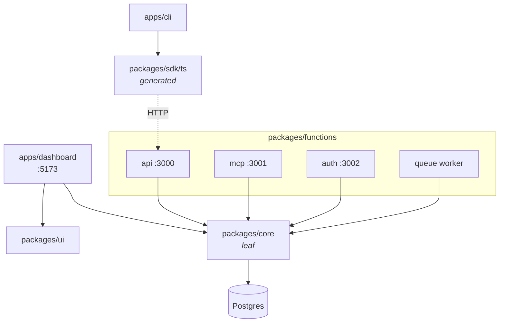
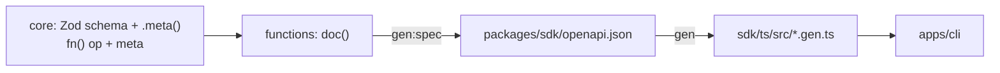

# Architecture

Bun workspaces monorepo. Postgres via Drizzle, Hono services, SvelteKit dashboard.

Two things that surprise people:

- **The dashboard skips HTTP.** It imports `@template/core` directly from its remote
  functions — same process, no network hop. The SDK exists for the CLI and outside
  callers, not for the dashboard.
- **Core is a leaf.** It imports nothing from the workspace. Everything else may depend
  on it; it depends on no one. A cycle here is always a bug.

## Who owns what

| Path                 | Owns                                                                |
| -------------------- | ------------------------------------------------------------------- |
| `packages/core`      | Domain logic, Drizzle schema, migrations. All business rules.       |
| `packages/functions` | Hono services: `api`, `mcp`, `auth`, `queue`. Transport only.       |
| `apps/dashboard`     | SvelteKit UI, remote functions, routes.                             |
| `apps/cli`           | The one entrypoint that runs and talks to the stack.                |
| `packages/ui`        | Presentational Svelte components. No app imports, no IO.            |
| `packages/sdk/ts`    | Generated from `openapi.json`. Never hand-edited.                   |
| `scripts`            | `dev`, `seed`, `reset`, feature scaffold.                           |
| `infra`              | SST 4 (`infra/cf` live, `infra/aws` alternate) plus `infra/docker`. |

## Generation chain

It starts in core. A Zod schema there — with its `.meta({ description, example })` — is the
source of truth; a route reuses that schema rather than restating it, and everything
downstream is derived.

So a description written once in core ends up in the published SDK, and a missing one is
missing everywhere. Change a schema or a route and both steps must be re-run, in order.
**Ask the user to run them** — agents don't run `gen:spec`, `gen`, or `db:generate`.

## Adding a feature

`bun run scripts/feature.ts <name>` scaffolds the whole vertical: core module + test, API
handler, MCP tool, dashboard remote/components/page, and the route. Prefer it over hand-wiring — it
keeps the identifier prefix and the OpenAPI example registry in sync.
