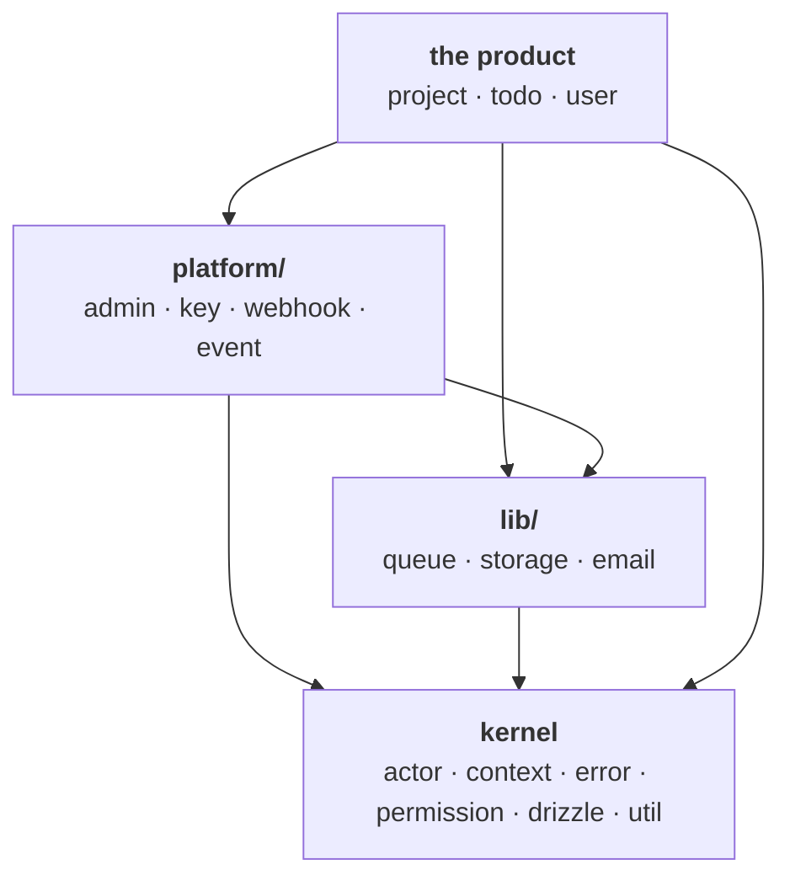

# Core

`packages/core` is a leaf: domain logic, schema, migrations. Four tiers, three of them
visible as directories.

Arrows are the only legal import direction. A cycle, or an arrow pointing up, is a bug.

| Tier        | What it is                                                                             |
| ----------- | -------------------------------------------------------------------------------------- |
| kernel      | Cross-cutting primitives, no tables of their own. Everyone may reach them.             |
| `lib/`      | A capability behind a `port.ts` + `adapter/`, picked at boot from env.                 |
| `platform/` | Full features (tables, `Actor.check`, API surface) generic to any app on the template. |
| product     | What a fork rewrites.                                                                  |

## Where does a new module go?

**When you fork this template into a real product, does the module get rewritten?**

- Yes → top level, next to `todo/`.
- No, but it has a table and an actor check → `platform/`.
- Never touched, only reconfigured → `lib/`, behind a port.

## Import paths stay flat

Grouping is a disk concern, invisible to consumers: `@template/core/key`, not
`@template/core/platform/key` — same as `lib/queue` exporting as `@template/core/queue`.
The `"./*"` wildcard in `package.json` only covers top-level directories, so **a grouped
module needs an explicit `exports` entry**. The Drizzle glob is `./src/**/*.sql.ts`, so
nesting never affects migrations.

## Known exceptions

- `lib/storage` reaches `platform/key` for `Signing.current`, inside `fromEnv` only — the
  port itself takes the key as an option, so nothing in the port layer knows about it.
- `platform/event` joins `user/user.sql` to name the actor on a log row. Platform may reach
  `user`, the identity anchor; nothing else in the product.
- `platform/admin` reads `project` and `todo` tables for its counts — the one arrow that
  points up. A fork rewrites the tallies in `counts`; the rest of the back office is generic.

File-level conventions (module shape, ordering inside a file) live in
[`packages/core/AGENTS.md`](../packages/core/AGENTS.md).
