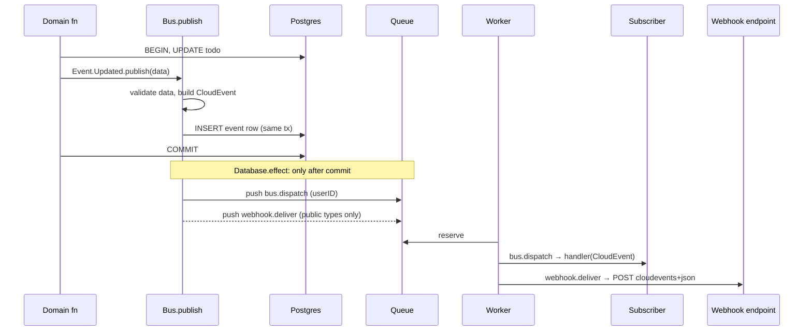
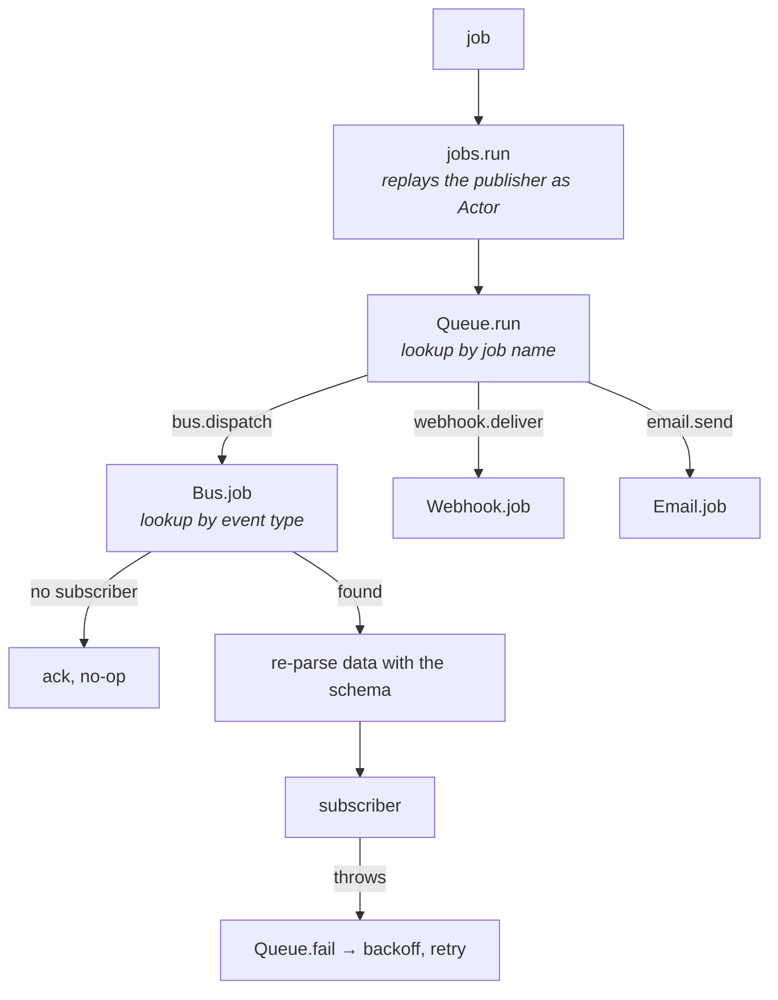
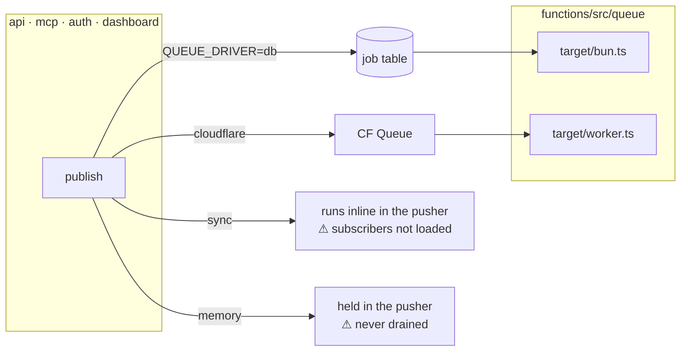
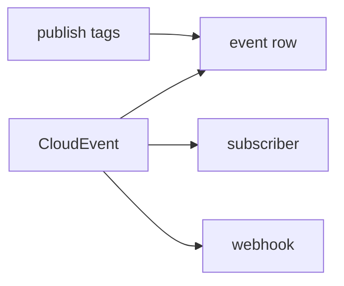
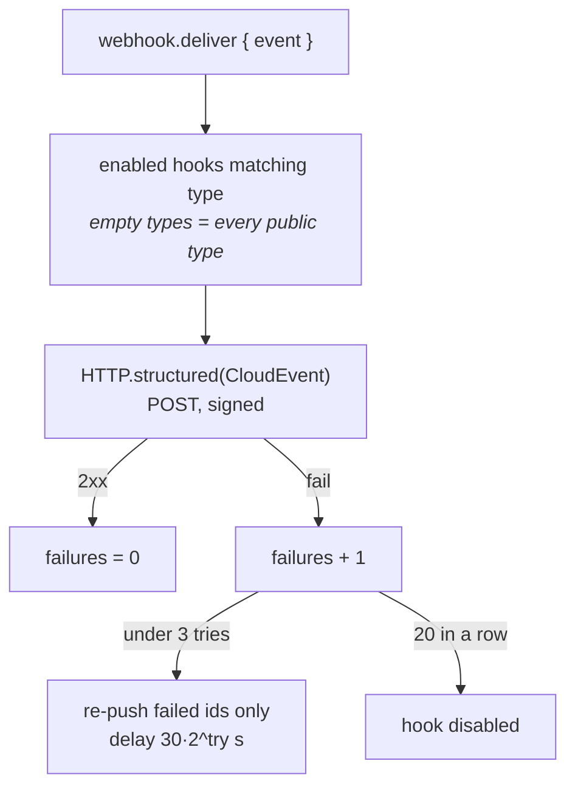

# Events

Typed domain events over the job queue. A slice declares and publishes its events, a
handler elsewhere subscribes, and every event travels as a [CloudEvents 1.0][ce] envelope.

| Piece       | Where                                | Role                                        |
| ----------- | ------------------------------------ | ------------------------------------------- |
| `Bus`       | `packages/core/src/platform/bus`     | `define`, `publish`, `subscribe`, dispatch  |
| `Event`     | `packages/core/src/platform/event`   | The audit log: `list`, `facets` (read-only) |
| `Webhook`   | `packages/core/src/platform/webhook` | Outbound HTTP for public types              |
| `Queue`     | `packages/core/src/lib/queue`        | Transport: drivers, retries, worker loop    |
| subscribers | `packages/core/src/subscribers.ts`   | The list a worker loads                     |

## Declare, publish, subscribe

```ts
// todo/index.ts: the slice owns its events
export const Event = {
  Created: Bus.define("todo.created", Info),
  Updated: Bus.define("todo.updated", z.object({ todo: Info, changes: Changes })),
};

// inside the domain transaction
await Todo.Event.Updated.publish({ todo, changes }, { subject: id, tags });

// elsewhere, never imported by the producer
export const sync = Bus.subscribe(Todo.Event.Updated, async (event) => {
  event.data.todo.status; // typed
});
```

## Flow



A rollback emits nothing. A crash between commit and push keeps the row and drops the jobs.

## Dispatch in the worker



- One subscriber per type. A second `subscribe`, or a second `define`, throws on load.
- Fan-out to several consumers is left to a broker adapter (Kafka consumer groups).
- Webhooks are not a subscriber: `publish` pushes them directly, so the slot stays free.

## Where handlers run

Only processes that import `@template/core/jobs` load `subscribers.ts`, and those are the
queue targets.



Use `db` or `cloudflare` anywhere a subscriber must run. `sync` and `memory` are for tests.

## The envelope

```json
{
  "specversion": "1.0",
  "id": "evt_01M3WGVZ7M95F7SW373TG6TX7G",
  "type": "todo.updated",
  "source": "template/todo",
  "subject": "tod_01M3WGVYWQ4X2G025DY07XDB9R",
  "time": "2026-10-01T20:00:38.649Z",
  "datacontenttype": "application/json",
  "data": {
    "todo": { "id": "tod_…", "title": "Write the report", "status": "active", "…": "…" },
    "changes": { "status": { "before": "backlog", "after": "active" } }
  },
  "authtype": "user",
  "authid": "usr_01M3WGVYNZNQDGJYCNZNT12GWY"
}
```

| Attribute             | From                                                               |
| --------------------- | ------------------------------------------------------------------ |
| `id`                  | `Identifier.create("event")`, also the audit row id                |
| `type`                | the `Bus.define` name                                              |
| `source`              | `` `${Bus.app}/${type prefix}` ``; names the software, not a host  |
| `subject`             | the entity id passed to `publish`                                  |
| `data`                | the payload, validated against the declared schema                 |
| `authtype` / `authid` | [Auth Context extension][auth]; `public` maps to `unauthenticated` |

Built with `platform/bus/cloudevent.ts`, a vendored slice of the [`cloudevents`][sdk] SDK
(`CloudEvent`, `cloneWith`, `toJSON`, `HTTP.structured`). The SDK itself requires Node
built-ins and breaks the Cloudflare bundles; the names match, so swapping back is an import.

## Who sees what



|                  | `data` | tags | actor                       | `source`        |
| ---------------- | ------ | ---- | --------------------------- | --------------- |
| Event row        | ✓      | ✓    | `user_id` + `actor:*` tag   | `todo`          |
| Subscriber       | ✓      | ✗    | `authtype`/`authid` + Actor | `template/todo` |
| Webhook receiver | ✓      | ✗    | `authtype`/`authid`         | `template/todo` |

Tags are for filtering the log only. A subscriber that needs a todo's tags reads them from
`data`.

## Webhooks

Public types are the catalog in `platform/webhook/types.ts`. It stays import-free, so the
browser can read it. Every other type is internal.



| Header                | Value                                             |
| --------------------- | ------------------------------------------------- |
| `content-type`        | `application/cloudevents+json; charset=utf-8`     |
| `x-webhook-id`        | the event `id`, stable across retries, for dedupe |
| `x-webhook-timestamp` | unix seconds                                      |
| `x-webhook-signature` | `sign(secret, body, timestamp)`                   |

## Adding an event

1. Declare it in the slice's `Event` object with a zod schema.
2. Publish it inside the transaction that makes the change, with `subject` set.
3. To expose it over webhooks, add the type to `platform/webhook/types.ts`.
4. To react to it, `Bus.subscribe` in the slice, export the handle, add it to
   `src/subscribers.ts`.

[ce]: https://github.com/cloudevents/spec/blob/main/cloudevents/spec.md
[auth]: https://github.com/cloudevents/spec/blob/main/cloudevents/extensions/authcontext.md
[sdk]: https://github.com/cloudevents/sdk-javascript
