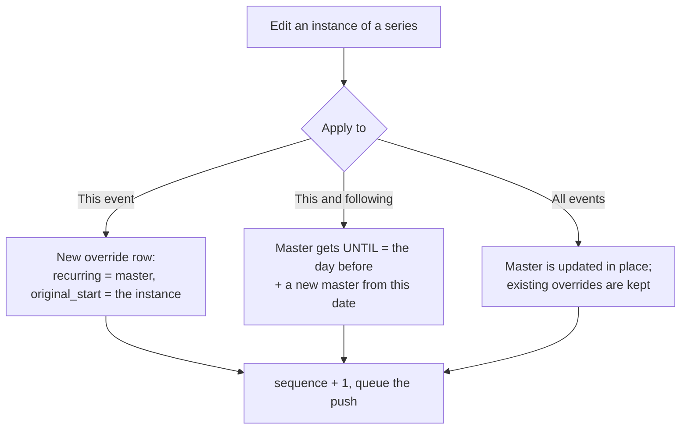
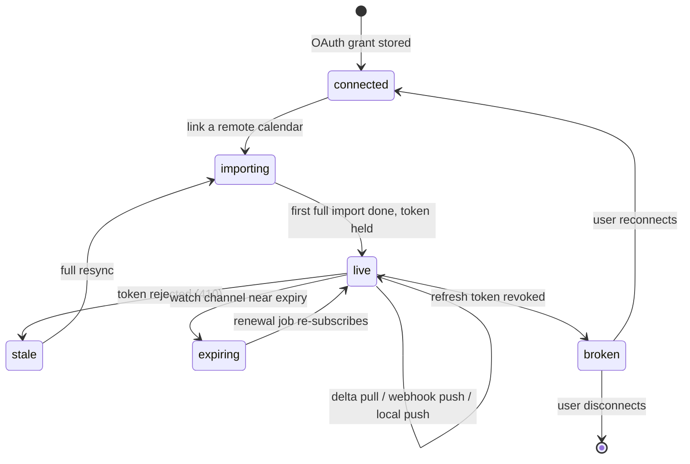
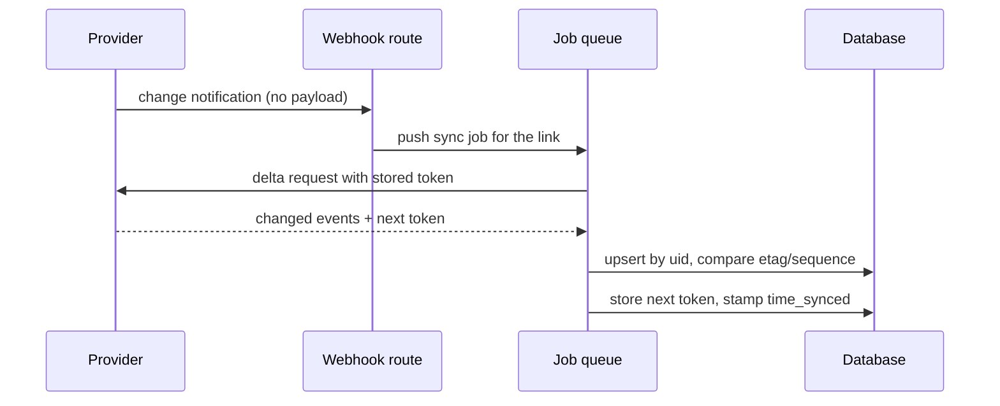
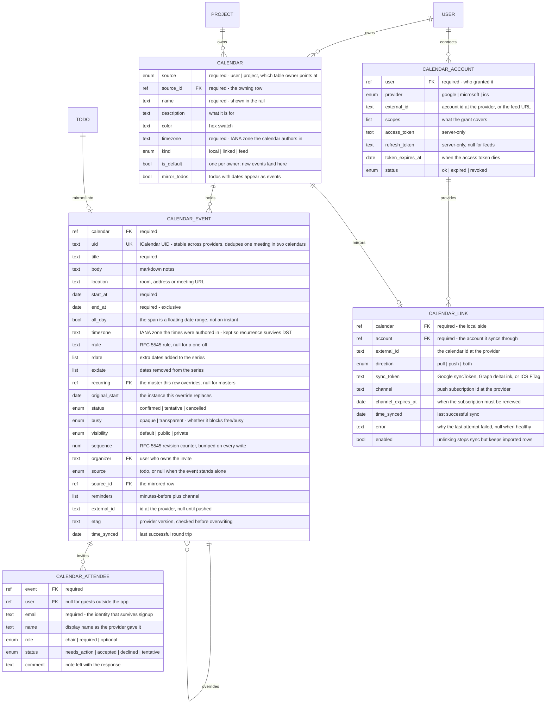

# Calendar

## Prototypes

### calendar.html

The main screen. The rail on the left lists every calendar the actor can see, grouped by
who owns it — mine, projects, subscribed feeds — and a linked calendar carries a small
provider badge. Untick one and its events leave every view. The toolbar switches between
month, week and agenda; the arrows move a month or a week at a time. Click any event for
the detail popover: recurring ones say how they repeat, a mirrored todo says so, a linked
one shows its sync age, and one with guests offers the RSVP buttons instead of Edit.

<iframe
  src="./calendar.html"
  width="100%"
  height="680"
  style="border:1px solid #ccc;border-radius:8px"
></iframe>

[Open calendar.html](./calendar.html)

### event-editor.html

Creating and editing. The recurrence block prints the `RRULE` it is building, because that
string is stored verbatim and handed to the provider unchanged. Switching the calendar
picker to a linked calendar changes the footer to say the save will also push. Saving a
recurring event asks what the change applies to — this event, this and following, or all —
and the confirmation spells out what each choice does to the series.

<iframe
  src="./event-editor.html"
  width="100%"
  height="680"
  style="border:1px solid #ccc;border-radius:8px"
></iframe>

[Open event-editor.html](./event-editor.html)

### connections.html

Settings. One card per connected account, each listing the provider's calendars with a
checkbox and a direction. The Microsoft card is in the failure state on purpose: a revoked
refresh token, pulls stopped, local changes queued behind it. Below the cards sit the four
settings that decide how sync behaves, and a live tail of what the sync worker did.

<iframe
  src="./connections.html"
  width="100%"
  height="680"
  style="border:1px solid #ccc;border-radius:8px"
></iframe>

[Open connections.html](./connections.html)

## Overview

Today the app has one thing called a calendar: a contribution heatmap on the insights page.
Todos carry `startDate` and `dueDate`, and the timeline view draws them, but there is no
notion of an appointment, of a block of time that belongs to someone, or of a schedule that
two people share.

This adds a real calendar. The unit is a **calendar** — a named container of events with a
colour and a timezone — and there can be many of them. A user has personal calendars; a
project has calendars its members read; a URL can be subscribed to as a read-only feed.
Every view is a union of the calendars you have ticked, which is the only reason multiple
calendars are worth having.

The second goal shapes everything else: a calendar should be linkable to Google Calendar or
Microsoft 365 without the model needing to change. Both providers speak the same dialect —
iCalendar (RFC 5545) — and both offer the same sync primitives: an incremental token, a
push subscription, an `etag` per event, a `sequence` counter for conflict resolution. So the
event model here is that dialect rather than a convenient local shape that would need a
lossy translation layer later. Recurrence is an `RRULE` string, not a bag of custom columns.
An override of one instance is a row pointing at its master, not a materialised series.
Fields we do not use yet still exist, because losing them on a round trip is how a two-way
sync corrupts someone's work calendar.

Linking is deliberately not part of the first build — nothing here calls a provider. What is
part of the first build is that adding it later is a sync worker and two tables, not a rewrite.

## Features

**Many calendars, owned by anything**

- A calendar belongs to an owner through the same `source` / `source_id` pair `todo` and
  `event` already use, so `user` and `project` are the two owners today and nothing needs a
  migration to become the third.
- Every user gets one default calendar on first login; every project gets one when created.
  New events land in the default unless the picker says otherwise.
- Each calendar has a name, a colour, a description and an IANA timezone. The timezone is
  the calendar's, not the viewer's — a project calendar in `Europe/Lisbon` reads correctly
  to someone in `America/Sao_Paulo`.
- The rail groups calendars by owner kind and remembers which are ticked. Untick a calendar
  and it disappears from month, week, agenda and free/busy alike.
- A calendar is `local` (we own the rows), `linked` (mirrored with a provider) or `feed`
  (read-only ICS). The kind decides which controls are even offered.

**Reading a schedule**

- Month, week and agenda views over the union of ticked calendars.
- All-day events render as blocks above the timed ones; tentative events render dashed.
- Recurring events are expanded at read time over the requested window, never stored
  expanded. Overrides replace their instance; cancelled instances leave a gap.
- Free/busy is derived from events whose `busy` is `opaque`, across every calendar a person
  has — including linked ones — so the conflict warning in the editor is honest even when
  the clash lives in someone's Google calendar.
- Todos with a start or due date can be mirrored into a calendar. They read as events with a
  check mark and moving one moves the todo.

**Creating and editing**

- Title, span, all-day toggle, timezone, calendar, location or meeting URL, notes.
- Recurrence is built with a small picker that shows the `RRULE` it produces.
- Editing an instance of a series asks for the scope first, because the three answers write
  three different things:

- Reminders are minutes-before entries on the event; they fire through the existing job
  queue with a delay rather than a polling scanner.

**Guests and responses**

- A guest is a user in the app or a bare email address. Both are stored the same way, so a
  guest who signs up later resolves to their user row without the invitation moving.
- Each guest has a role (chair, required, optional) and a response (no reply, accepted,
  declined, tentative). Responses are what an invited person sees instead of an edit button.

> [!NOTE]
> Do we send invitation email ourselves, or store guests locally and let the linked provider
> do the emailing? Sending both ways means duplicate invites for any linked calendar. The
> mockup has this as an off-by-default setting; it may be better as a per-calendar choice.

**Linking to Google and Microsoft**

- An account is connected once (OAuth), then each of its remote calendars can be linked to a
  local calendar with a direction: pull, push, or both.
- Sync is incremental. Google hands back a `syncToken`, Microsoft a `deltaLink`, ICS an
  `ETag` — all three are the same column, and all three mean "give me what changed".
- Providers push too: Google watch channels and Graph subscriptions both call a webhook when
  something moves, so a change lands in seconds rather than at the next poll. Both expire —
  Google in weeks, Microsoft in about three days — so renewal is a scheduled job, not a
  setup step.
- Conflicts are resolved by `sequence`, then `etag`, then last-write-wins, with the policy
  configurable per account.

- A broken link never drops writes. Local changes queue against the link and drain when it
  is healthy again, which is the state the Microsoft card in the mockup is showing.

> [!NOTE]
> A linked calendar is assumed to map to exactly one remote calendar, which lets the event
> carry `external_id` and `etag` directly instead of needing a join table. Mirroring one
> local calendar into two providers at once would need that table. Worth it now, or later?

## Out of scope

- Room and resource booking, and anything that treats a room as an invitee.
- Scheduling links, availability pages, or automatic meeting-slot suggestion.
- Video conferencing: a meeting URL is a text field, not a provider integration.
- CalDAV as a server — we consume feeds, we do not publish them.
- Attachments on events.
- Working hours, out-of-office and their effect on free/busy.

## Data model

Every table carries the repo's shared columns: `id`, `time_created`, `time_updated`,
`time_deleted`, and `created_by` where a person authored the row.

- The enums, since a rendered diagram may show only names: a calendar's `source` is `user`
  or `project` and its `kind` is `local`, `linked` or `feed`; an event's `status` is
  `confirmed`, `tentative` or `cancelled`, its `busy` is `opaque` or `transparent`, its
  `visibility` is `default`, `public` or `private`; an attendee's `role` is `chair`,
  `required` or `optional` and their `status` is `needs_action`, `accepted`, `declined` or
  `tentative`; a link's `direction` is `pull`, `push` or `both`; an account's `provider` is
  `google`, `microsoft` or `ics` and its `status` is `ok`, `expired` or `revoked`.
- `uid` is the identity that crosses systems. The same meeting arriving in a personal and a
  project calendar is two rows with one `uid`, which is how the views dedupe it.
- `sequence` on an event is the RFC 5545 revision counter, bumped on every write and used
  before `etag` when deciding which side of a conflict wins.
- A recurring series is one master row plus one override row per edited instance. Instances
  are never stored; they are expanded per query window.
- `start_at` / `end_at` are instants for timed events. When `all_day` is set they are read as
  floating dates, so an all-day event does not shift for a viewer in another timezone.
- `external_id` and `etag` live on the event rather than a mapping table, which holds only
  because a calendar links to at most one remote calendar.
- Tokens on `CALENDAR_ACCOUNT` follow the existing `provider` table: stored as given, never
  serialised out of core.

> [!NOTE]
> Who may read a project calendar? Projects have no membership table today — `member` sees
> every project — so the simplest rule is that a calendar has no permissions of its own and
> inherits its owner's. That is right until projects gain members, and wrong the day they do.
> Adding a per-calendar ACL now is cheap; retrofitting it is not.
