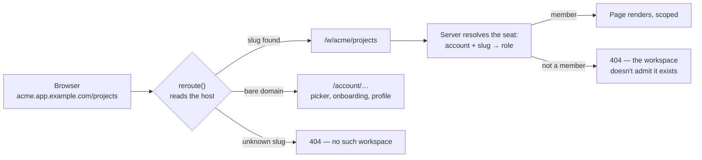
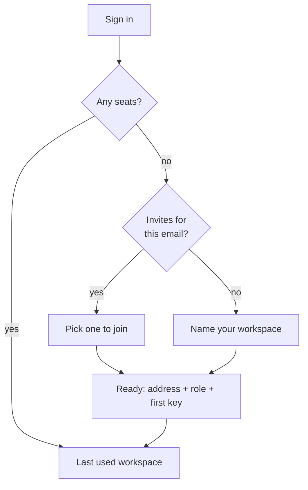
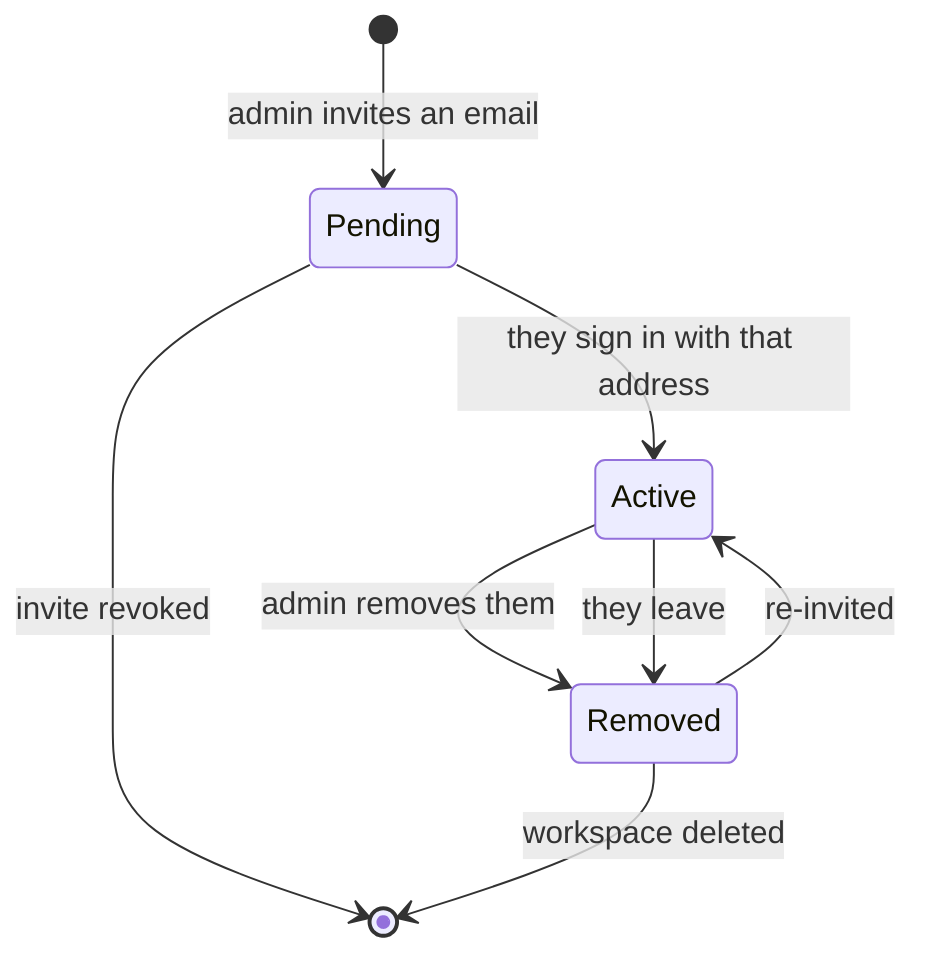
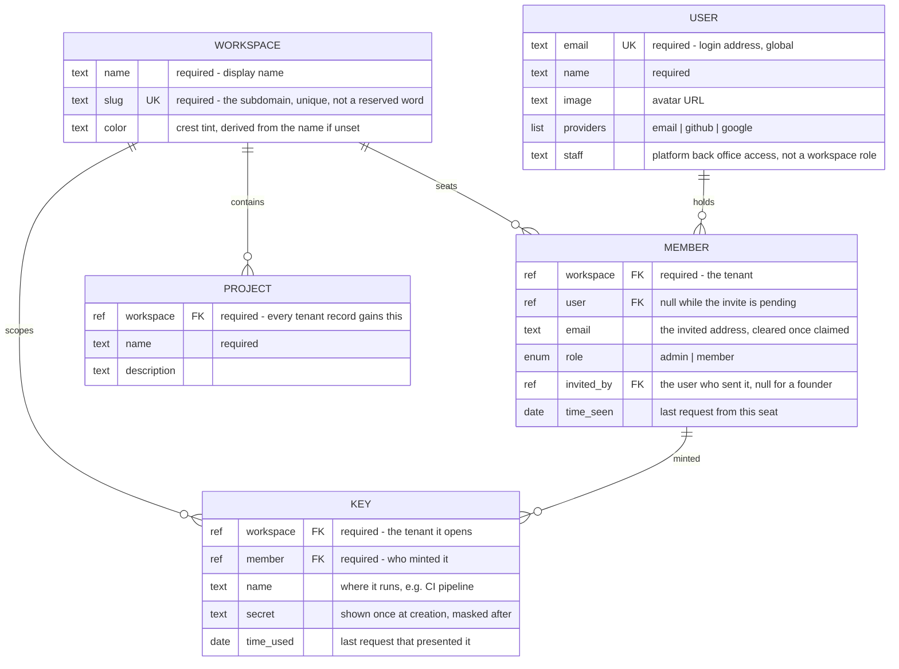

# Workspaces

## Prototypes

### switcher.html

The app shell with the workspace crest top-left. Open it, search, and switch — the projects,
the role badge and the address all change together. Each workspace is its own subdomain, so
switching is a real navigation to `<slug>.app.example.com`; the badge next to the URL shows
what `reroute` rewrites the request to internally.

<iframe
  src="./switcher.html"
  width="100%"
  height="620"
  style="border:1px solid #ccc;border-radius:8px"
></iframe>

[Open switcher.html](./switcher.html)

### members.html

The roster and the invite flow. Change someone's role, remove them, invite an address, revoke a
pending seat. Flip **viewing as** to `member` to see the same screen read-only — and note the
guards: you can't demote yourself, and the last admin can't be removed.

<iframe
  src="./members.html"
  width="100%"
  height="700"
  style="border:1px solid #ccc;border-radius:8px"
></iframe>

[Open members.html](./members.html)

### settings.html

Name, address and lifecycle. Type in the name field to watch the crest follow it; edit the slug
to see live validation against reserved and taken subdomains. The danger zone wants the slug
typed back before it will delete.

<iframe
  src="./settings.html"
  width="100%"
  height="700"
  style="border:1px solid #ccc;border-radius:8px"
></iframe>

[Open settings.html](./settings.html)

### onboarding.html

What a brand-new account sees. Two scenes, toggled at the top: someone who was invited picks a
team to join, someone who wasn't names their own. Both land on the same confirmation, which
hands over the address and the first API key.

<iframe
  src="./onboarding.html"
  width="100%"
  height="620"
  style="border:1px solid #ccc;border-radius:8px"
></iframe>

[Open onboarding.html](./onboarding.html)

### keys.html

Per-workspace API keys. Mint one and the secret is shown exactly once. As `admin` you see every
key in the workspace but only your own secrets; as `member` you see only the keys you minted.

<iframe
  src="./keys.html"
  width="100%"
  height="660"
  style="border:1px solid #ccc;border-radius:8px"
></iframe>

[Open keys.html](./keys.html)

## Overview

Today the app has one implicit organisation: everyone who signs in sees every project, every
todo, every event. **Workspaces** make the tenant explicit. A workspace owns the work; people
join it; the same person can belong to several and hold a different role in each.

The model follows opencode's console: a global account (the person, their email and login
providers) is separate from a membership (that person's seat in one workspace, with its own
role). One human, one login, many seats.

Each workspace lives at its own subdomain — `acme.app.example.com`. That is not decoration: the
host is on every request the browser makes, including the background calls the pages fire, which
a path segment isn't. It gives us one unambiguous answer to "which tenant is this?" for page
loads, form posts and API calls alike, and it makes a workspace something you can bookmark, pin
in a tab, and hand to a teammate.

The bare domain — `app.example.com` — is the account's own space: the workspace picker,
onboarding, and personal profile. It is the only place that works before you belong anywhere.

## Features

**Addressing**

- Every workspace has a slug, and the slug is the subdomain. `acme.app.example.com/projects`.
- The slug is editable; changing it moves the workspace and leaves the old address dead.
- Reserved slugs (`www`, `api`, `auth`, `app`, `admin`, `static`, `mail`) can't be claimed.
- The bare domain is account-level: picker, onboarding, profile, and the sign-in redirect target.
- Sessions are shared across subdomains, so switching workspaces never asks you to sign in again.

> [!NOTE]
> An unknown slug and a workspace you're simply not in both render 404 on purpose — a 403 would
> confirm that `competitor.app.example.com` exists. Worth confirming that's the behaviour we want.

**Switching**

- The crest, top-left of the sidebar, names the current workspace and your role in it.
- Opening it lists every workspace you belong to, searchable, current one ticked.
- Picking one navigates to that subdomain. The last one you used is where the bare domain sends you.
- "Create workspace" sits at the bottom of the same list.

**First run**

- Signing in with no seat anywhere lands on the account domain, never a dead app shell.
- Invitations waiting for your address are offered first — join one, or start your own.
- Creating a workspace makes you its admin, derives the slug from the name, and mints a first API key.

**Members and invites**

- Two roles: `admin` (everything, including members, settings and billing) and `member`.
- Roles are per workspace — an admin of one is a plain member of another.
- Invite by email. The seat exists immediately as *pending*, whether or not that person has an account.
- On their next sign-in, every pending seat matching their address becomes a real membership.
- Removing someone revokes access but leaves their work in place.
- Guards: you can't change your own role, and the last admin can't be demoted or removed.

**Workspace settings**

- Rename, re-slug, and pick a colour for the crest.
- Danger zone: leave (blocked for the last admin) and delete, gated on typing the slug back.
- Members see settings read-only rather than not at all — fewer "where is it?" questions.

**API keys**

- Keys belong to the workspace, not the person. A key authenticates straight into one tenant.
- The secret is shown once, at mint time; afterwards only a masked tail.
- Admins see every key in the workspace but only their own secrets; members see only their own keys.
- Revoking is immediate. The CLI and the MCP server both take the same key.

> [!NOTE]
> A key is minted automatically on workspace creation, which is convenient but means an
> unused secret exists by default. Keep it, or make the first key an explicit step?

## Data model

Every table already carries the shared columns — id, created/updated/deleted timestamps, and
`created_by` where it applies; the fields below are what workspaces add on top.

- A membership is either **pending** (`email` set, `user` null) or **active** (the reverse) —
  never both, never neither.
- One seat per address per workspace, and one seat per user per workspace.
- Ids of tenant records are unique within a workspace, not globally — reading one always takes
  the workspace with it.
- `todo`, `event`, `webhook` and queued jobs gain the same workspace reference as `project`.
- Uploaded files are stored under a per-workspace prefix, so a signed URL can't be replayed
  against another tenant.
- `staff` on USER is deliberately outside the workspace roles: a workspace admin must not
  inherit the platform back office.

> [!NOTE]
> Deleting a workspace is soft for 30 days in the mockup. Where does the "recover a deleted
> workspace" entry point live — the account screen, or support only?

## Out of scope

- Billing, plans, seat counts and spend limits.
- Nested teams or groups inside a workspace; roles stay flat at admin/member.
- Per-resource sharing — access is all-or-nothing at the workspace boundary.
- Transferring a workspace to another owner, or merging two workspaces.
- SSO, SCIM and domain capture ("anyone with an @acme.com address joins automatically").
- Custom domains beyond the `*.app.example.com` wildcard.
- Migrating the existing single-tenant data into a first workspace — a plan concern, not a screen.
