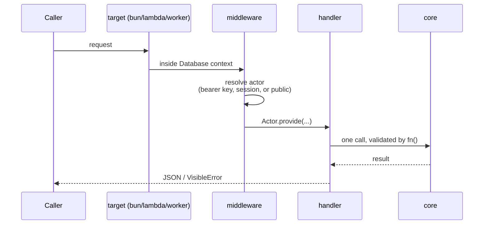
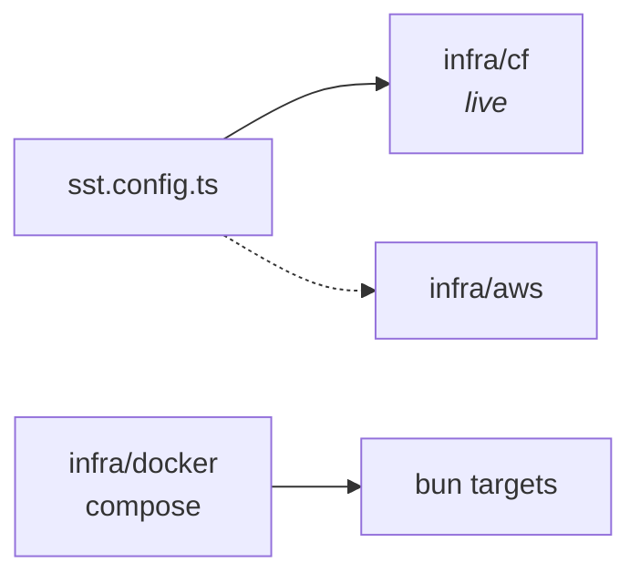

# Runtime

## One request

Every service is a plain Hono app. The _target_ wraps it with a database connection and
whatever else the environment provides; the app itself never knows where it runs.

Two rules fall out of this. Handlers stay thin — validate, call one core function, return.
And core never reads a header: everything it needs about the caller comes from `Actor`.

## Targets

`packages/functions/src/target.ts` has one function per environment, and each service has
a `target/` directory that picks one:

| Target   | Database                          | Used by                     |
| -------- | --------------------------------- | --------------------------- |
| `bun`    | One pool per process              | `bun dev`, Docker           |
| `lambda` | Pool from env, streamed responses | `infra/aws`                 |
| `worker` | Fresh pool per request            | `infra/cf` (via Hyperdrive) |

The worker's per-request pool isn't an oversight — Workers forbid reusing a socket across
requests. Likewise `bun` cycles its pool when `PG_RELEASE=true`, because dev pglite allows
exactly one live connection and the dashboard needs it back.

## Deploy

`sst.config.ts` imports `infra/cf`; `infra/aws` is the alternate wiring. `infra/docker`
runs the same `bun` targets under Compose — note its migrate step copies a real Node
binary, because `drizzle-kit` needs `node:sqlite`, which Bun doesn't have.

**Agents never deploy.** No `sst deploy`, no `sst remove`, no infra-mutating command —
prepare the change and hand the command to the user.

## Local stack

`bun dev` runs everything. `DB=pglite` keeps Postgres in-process, `RESET=1` wipes it.
